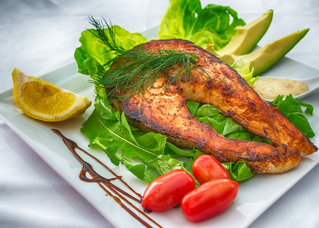

# Roasty
This describes a simple application that uses mealdb in plain Js

## Description
Using the DOM to manipulate page and add custom elements

## Built with
This application was build with the technologies....

- HTML
- JS
- CSS
- [Bootstrap](https://getbootstrap.com)

## Getting started

To get started, you need to do the following

- clone repository
 
    git clone https://github.com

- Install JS dependancies

    NPM install

## Screenshots

This is how my app looks like: 

    